# Java Abstraction Lab

## Table of Contents
1. [Understanding Abstraction](#1-understanding-abstraction)
2. [Abstract Classes](#2-abstract-classes)
3. [Interfaces](#3-interfaces)
4. [Abstract Classes vs. Interfaces](#4-abstract-classes-vs-interfaces)
5. [Practical Applications](#5-practical-applications)

## Lab Setup
1. Create a package called `ie.atu.abstraction`
2. Create a `Main` class inside this package
3. Place all the below classes from the DIY sections into this package

## 1. Understanding Abstraction

### Learning Objective
Understand what abstraction is and how it helps us write better code by hiding complicated details.

### Real-World Example
Think about driving a car. To drive a car, you only need to know about:
- The steering wheel
- The pedals (gas and brake)
- The gear shift

You don't need to know how the engine works, how the transmission functions, or how the electrical system operates. This is abstraction - hiding complex details while showing only what's necessary to use something.

```mermaid
%%{init: {'theme': 'base', 'themeVariables': { 'primaryColor': '#4CAF50', 'primaryTextColor': '#fff', 'primaryBorderColor': '#2E7D32', 'lineColor': '#FF9800', 'secondaryColor': '#2196F3', 'tertiaryColor': '#E3F2FD'}}}%%
flowchart TB
    subgraph visible["🚗 What You See"]
        style visible fill:#E8F5E9,stroke:#4CAF50,stroke-width:3px,color:#1B5E20
        SW["🎡 Steering Wheel"]
        P["🦶 Pedals"]
        GS["⚙️ Gear Shift"]
    end
    
    subgraph hidden["🔧 Hidden Complexity"]
        style hidden fill:#FFEBEE,stroke:#EF5350,stroke-width:3px,color:#B71C1C
        E["🔥 Engine"]
        T["⚡ Transmission"]
        ES["🔌 Electrical System"]
        FS["⛽ Fuel System"]
        BS["🛑 Brake System"]
    end
    
    SW --> hidden
    P --> hidden
    GS --> hidden
    
    classDef visibleClass fill:#C8E6C9,stroke:#4CAF50,stroke-width:2px,color:#1B5E20
    classDef hiddenClass fill:#FFCDD2,stroke:#EF5350,stroke-width:2px,color:#B71C1C
    
    class SW,P,GS visibleClass
    class E,T,ES,FS,BS hiddenClass
```

> **Key Concept:** Abstraction is like the dashboard of a car — it shows you only what you need to operate the vehicle while hiding all the complex machinery underneath.

### Simple Code Example: Animal Sounds
Let's create a simple system for animal sounds:

```mermaid
%%{init: {'theme': 'base', 'themeVariables': { 'primaryColor': '#9C27B0', 'primaryTextColor': '#4A148C', 'primaryBorderColor': '#6A1B9A', 'lineColor': '#FF9800', 'secondaryColor': '#03A9F4', 'tertiaryColor': '#E1BEE7', 'classText': '#4A148C'}}}%%
classDiagram
    class Animal {
        <<abstract>>
        #String name
        #int age
        +Animal(String name, int age)
        +makeSound()* void
        +introduce() void
    }
    
    class Dog {
        +Dog(String name, int age)
        +makeSound() void
    }
    
    class Cat {
        +Cat(String name, int age)
        +makeSound() void
    }
    
    Animal <|-- Dog : extends
    Animal <|-- Cat : extends
    
    note for Animal "🔷 Abstract Class\nCannot be instantiated directly\nContains abstract method makeSound()"
    note for Dog "🐕 Concrete Class\nmakeSound() → 'Woof! Woof!'"
    note for Cat "🐱 Concrete Class\nmakeSound() → 'Meow!'"
```

```java
// This is our abstract class - it defines what all animals can do
public abstract class Animal {
    // Properties that all animals have
    protected String name;
    protected int age;
    
    // Constructor to set up basic animal properties
    public Animal(String name, int age) {
        this.name = name;
        this.age = age;
    }
    
    // Abstract method - each animal must implement their own sound
    public abstract void makeSound();
    
    // Regular method all animals can use as-is
    public void introduce() {
        System.out.println("I am " + name + " and I am " + age + " years old");
    }
}

// A specific type of animal
public class Dog extends Animal {
    public Dog(String name, int age) {
        super(name, age);
    }
    
    // Dog's specific implementation of makeSound
    @Override
    public void makeSound() {
        System.out.println("Woof! Woof!");
    }
}

// Another type of animal
public class Cat extends Animal {
    public Cat(String name, int age) {
        super(name, age);
    }
    
    // Cat's specific implementation of makeSound
    @Override
    public void makeSound() {
        System.out.println("Meow!");
    }
}
```

Using these animals:
```java
public class Main {
    public static void main(String[] args) {
        // Create some animals
        Animal spot = new Dog("Spot", 3);
        Animal whiskers = new Cat("Whiskers", 2);
        
        // Make them introduce themselves and make sounds
        spot.introduce();      // Prints: I am Spot and I am 3 years old
        spot.makeSound();      // Prints: Woof! Woof!
        
        whiskers.introduce();  // Prints: I am Whiskers and I am 2 years old
        whiskers.makeSound();  // Prints: Meow!
    }
}
```

### DIY Exercise: Simple Shape System
Create a basic shape system with three classes: `Shape`, `Circle`, `Square`, and a `Main` class to test them.

```mermaid
%%{init: {'theme': 'base', 'themeVariables': { 'primaryColor': '#FF5722', 'primaryTextColor': '#BF360C', 'primaryBorderColor': '#E64A19', 'lineColor': '#4CAF50', 'secondaryColor': '#FFC107', 'tertiaryColor': '#FBE9E7', 'classText': '#BF360C'}}}%%
classDiagram
    class Shape {
        <<abstract>>
        #String color
        +Shape(String color)
        +getArea()* double
        +displayColor() void
    }
    
    class Circle {
        -double radius
        +Circle(String color, double radius)
        +getArea() double
    }
    
    class Square {
        -double sideLength
        +Square(String color, double sideLength)
        +getArea() double
    }
    
    Shape <|-- Circle : extends
    Shape <|-- Square : extends
    
    note for Shape "📐 Abstract Blueprint\nDefines what all shapes must do"
    note for Circle "🔴 Area = π × radius²"
    note for Square "🟦 Area = side × side"
```

#### Step 1: Create an abstract class named `Shape`
Copy this code into a new file called `Shape.java`:
```java
public abstract class Shape {
    protected String color;
    
    public Shape(String color) {
        this.color = color;
    }
    
    // Every shape must implement this
    public abstract double getArea();
    
    // All shapes can use this as-is
    public void displayColor() {
        System.out.println("I am " + color + " in color");
    }
}
```

#### Step 2: Create a calss named `Circle` which extends the `Shape` class
- Add a `radius` instance variable (type `double`)
- Add a constructor that takes `color` and `radius` as parameters
- Implements the `getArea()` method using the formula: `π × radius²`
  - Hint: Use `Math.PI * radius * radius`

#### Step 3: Create a class named `Square` whcih extends the `Shape` class
- Add a `sideLength` instance variable (type `double`)
- Add a constructor that takes `color` and `sideLength` as parameters
- Implements the `getArea()` method using the formula: `sideLength × sideLength`

#### Step 4: Create the `Main` class to test your shapes
```java
public class Main {
    public static void main(String[] args) {
        // Use Shape references (polymorphism)
        Shape circle = new Circle("Red", 5.0);
        Shape square = new Square("Blue", 4.0);
        
        // Test the circle below by calling the getArea() and displayColor() methods

        
        // Test the square below by calling the getArea() and displayColor() methods
  
    }
}
```

> **Note:** We use `Shape` as the reference type (`Shape circle = ...`) instead of `Circle` to demonstrate polymorphism—the same principle shown in the Animal example above.

## 2. Abstract Classes

### Learning Objective
Understand what abstract classes are and how they help us create a blueprint for related objects.


### Simple Example: Remote Controls
Let's create a simple remote control system:

```mermaid
%%{init: {'theme': 'base', 'themeVariables': { 'primaryColor': '#673AB7', 'primaryTextColor': '#311B92', 'primaryBorderColor': '#512DA8', 'lineColor': '#FF9800', 'secondaryColor': '#8BC34A', 'tertiaryColor': '#EDE7F6', 'classText': '#311B92'}}}%%
classDiagram
    class RemoteControl {
        <<abstract>>
        #boolean isOn
        #String deviceName
        +RemoteControl(String deviceName)
        +powerButton()* void
        +volumeUp()* void
        +volumeDown()* void
        +displayStatus() void
    }
    
    class TVRemote {
        +TVRemote()
        +powerButton() void
        +volumeUp() void
        +volumeDown() void
    }
    
    RemoteControl <|-- TVRemote : extends
    
    note for RemoteControl "📺 Abstract Blueprint\nDefines what ALL remotes must do"
    note for TVRemote "🎮 Concrete Implementation\nProvides TV-specific behavior"
```

```java
public abstract class RemoteControl {
    protected boolean isOn;
    protected String deviceName;
    
    public RemoteControl(String deviceName) {
        this.deviceName = deviceName;
        this.isOn = false;
    }
    
    // All remote controls must implement these
    public abstract void powerButton();
    public abstract void volumeUp();
    public abstract void volumeDown();
    
    // All remote controls can use this
    public void displayStatus() {
        System.out.println(deviceName + " is " + (isOn ? "ON" : "OFF"));
    }
}

public class TVRemote extends RemoteControl {
    public TVRemote() {
        super("TV");
    }
    
    @Override
    public void powerButton() {
        isOn = !isOn;
        System.out.println("TV turning " + (isOn ? "on" : "off"));
    }
    
    @Override
    public void volumeUp() {
        if (isOn) {
            System.out.println("TV volume increasing");
        }
    }
    
    @Override
    public void volumeDown() {
        if (isOn) {
            System.out.println("TV volume decreasing");
        }
    }
}
```

### DIY Exercise: Vehicles
Create a simple vehicle system:

1. Create an abstract `Vehicle` class with:
   - Instance Variable: brand
   - Regular method: displayInfo()
   - Abstract methods: startEngine(), stopEngine()

2. Create two types of vehicles the inherit from the abstract Vehicle class:
   - Car
   - Motorcycle

3. Inside the Main class in the main() method, create two new Vehicles, Car and Motorcycle, and test all their methods. 

Example solution for Vehicle class:
```java
public abstract class Vehicle {
    protected String brand;
    protected String model;
    
    public Vehicle(String brand, String model) {
        this.brand = brand;
        this.model = model;
    }

    // Regular concrete method with body and implementation
    public void displayInfo() {
        System.out.println("This is a " + brand + " " + model);
    }

    // Abstract methods go below here. They will just be method signatures.

}
```

## 3. Interfaces

### Learning Objective
Understand interfaces as contracts that classes must follow.

### Real-World Example
Think of a power outlet. Any device with the right plug can connect to it, regardless of what the device does. The power outlet is like an interface - it defines a standard way of connecting.

```mermaid
%%{init: {'theme': 'base', 'themeVariables': { 'primaryColor': '#00BCD4', 'primaryTextColor': '#006064', 'primaryBorderColor': '#0097A7', 'lineColor': '#FF5722', 'secondaryColor': '#FF9800', 'tertiaryColor': '#E0F7FA'}}}%%
flowchart LR
    subgraph interface["🔌 INTERFACE (Power Outlet)"]
        style interface fill:#E0F7FA,stroke:#00BCD4,stroke-width:3px,color:#006064
        I["Standard Connection<br/>Contract"]
    end
    
    subgraph devices["🏠 DEVICES (Implementations)"]
        style devices fill:#FFF3E0,stroke:#E65100,stroke-width:3px,color:#BF360C
        D1["💻 Laptop"]
        D2["📱 Phone Charger"]
        D3["🔌 Lamp"]
        D4["📺 TV"]
    end
    
    D1 --> |"implements"| I
    D2 --> |"implements"| I
    D3 --> |"implements"| I
    D4 --> |"implements"| I
    
    classDef interfaceNode fill:#B2EBF2,stroke:#00ACC1,stroke-width:2px,color:#006064
    classDef deviceNode fill:#FFE0B2,stroke:#E65100,stroke-width:2px,color:#BF360C
    
    class I interfaceNode
    class D1,D2,D3,D4 deviceNode
```

> **Key Concept:** An interface is like a contract — any class that "signs" the contract (implements the interface) promises to provide specific behaviors.

### Simple Code Example: Musical Instruments

```mermaid
%%{init: {'theme': 'base', 'themeVariables': { 'primaryColor': '#E91E63', 'primaryTextColor': '#880E4F', 'primaryBorderColor': '#C2185B', 'lineColor': '#9C27B0', 'secondaryColor': '#4CAF50', 'tertiaryColor': '#FCE4EC', 'classText': '#880E4F'}}}%%
classDiagram
    class MusicalInstrument {
        <<interface>>
        +play() void
        +stop() void
        +tune() void
    }
    
    class Piano {
        +play() void
        +stop() void
        +tune() void
    }
    
    class Guitar {
        +play() void
        +stop() void
        +tune() void
    }
    
    MusicalInstrument <|.. Piano : implements
    MusicalInstrument <|.. Guitar : implements
    
    note for MusicalInstrument "🎵 Interface Contract\nDefines WHAT instruments can do\n(not HOW they do it)"
    note for Piano "🎹 play() → 'Piano playing beautiful music'"
    note for Guitar "🎸 play() → 'Guitar strumming chords'"
```

```java
// The interface defines what methods musical instruments must have
public interface MusicalInstrument {
    void play();
    void stop();
    void tune();
}

// A piano that implements the MusicalInstrument interface
public class Piano implements MusicalInstrument {
    @Override
    public void play() {
        System.out.println("Piano playing beautiful music");
    }
    
    @Override
    public void stop() {
        System.out.println("Piano stopped playing");
    }
    
    @Override
    public void tune() {
        System.out.println("Piano being tuned");
    }
}

// A guitar that also implements MusicalInstrument
public class Guitar implements MusicalInstrument {
    @Override
    public void play() {
        System.out.println("Guitar strumming chords");
    }
    
    @Override
    public void stop() {
        System.out.println("Guitar stopped playing");
    }
    
    @Override
    public void tune() {
        System.out.println("Guitar strings being tuned");
    }
}
```

### DIY Exercise: Simple Game Characters
Create a simple game character system:

1. Create an interface called `GameCharacter`:
```java
public interface GameCharacter {
    void move();
    void speak();
    void useItem();
}
```

2. Create two types of characters that implement this interface:
   - Hero
   - Villain

Each should implement the methods in their own way.

## 4. Abstract Classes vs. Interfaces

### Learning Objective
Understand when to use abstract classes versus interfaces.

### Simple Comparison
Think of it this way:
- Abstract Class: "is-a" relationship (a Dog is an Animal)
- Interface: "can-do" relationship (a Bird can Fly)

```mermaid
%%{init: {'theme': 'base', 'themeVariables': { 'primaryColor': '#607D8B', 'primaryTextColor': '#333', 'primaryBorderColor': '#455A64', 'lineColor': '#FF5722', 'secondaryColor': '#8BC34A', 'tertiaryColor': '#ECEFF1'}}}%%
flowchart TB
    subgraph comparison["🔄 ABSTRACT CLASS vs INTERFACE"]
        style comparison fill:#FAFAFA,stroke:#607D8B,stroke-width:2px,color:#333
        
        subgraph abstract["🔷 ABSTRACT CLASS"]
            style abstract fill:#E3F2FD,stroke:#2196F3,stroke-width:3px,color:#0D47A1
            A1["📌 'IS-A' Relationship"]
            A2["✅ Can have constructors"]
            A3["✅ Can have instance variables"]
            A4["✅ Can have concrete methods"]
            A5["⚠️ Single inheritance only"]
            A6["🎯 Use for: Related objects<br/>sharing common code"]
        end
        
        subgraph interfaces["🟡 INTERFACE"]
            style interfaces fill:#FFF8E1,stroke:#F57C00,stroke-width:3px,color:#E65100
            I1["📌 'CAN-DO' Relationship"]
            I2["❌ No constructors"]
            I3["❌ No instance variables*"]
            I4["✅ Default methods (Java 8+)"]
            I5["✅ Multiple implementation"]
            I6["🎯 Use for: Unrelated objects<br/>sharing behavior"]
        end
    end
    
    classDef abstractNode fill:#BBDEFB,stroke:#1976D2,stroke-width:2px,color:#0D47A1
    classDef interfaceNode fill:#FFE0B2,stroke:#F57C00,stroke-width:2px,color:#E65100
    
    class A1,A2,A3,A4,A5,A6 abstractNode
    class I1,I2,I3,I4,I5,I6 interfaceNode
```

```mermaid
%%{init: {'theme': 'base', 'themeVariables': { 'primaryColor': '#009688', 'primaryTextColor': '#004D40', 'primaryBorderColor': '#00796B', 'lineColor': '#FF9800', 'secondaryColor': '#E91E63', 'tertiaryColor': '#E0F2F1'}}}%%
flowchart LR
    subgraph example["🐕 Real Example: Dog"]
        style example fill:#E0F2F1,stroke:#009688,stroke-width:3px,color:#004D40
        
        DOG["🐕 Dog Class"]
        
        subgraph isa["IS-A (extends)"]
            style isa fill:#E3F2FD,stroke:#2196F3,stroke-width:2px,color:#0D47A1
            ANIMAL["🐾 Animal<br/>(Abstract Class)"]
        end
        
        subgraph cando["CAN-DO (implements)"]
            style cando fill:#FFF8E1,stroke:#F57C00,stroke-width:2px,color:#E65100
            PLAY["🎾 Playable<br/>(Interface)"]
            TRAIN["🎓 Trainable<br/>(Interface)"]
        end
        
        DOG --> |"extends"| ANIMAL
        DOG --> |"implements"| PLAY
        DOG --> |"implements"| TRAIN
    end
    
    classDef dogNode fill:#B2DFDB,stroke:#00897B,stroke-width:2px,color:#004D40
    classDef abstractNode fill:#BBDEFB,stroke:#1976D2,stroke-width:2px,color:#0D47A1
    classDef interfaceNode fill:#FFE0B2,stroke:#F57C00,stroke-width:2px,color:#E65100
    
    class DOG dogNode
    class ANIMAL abstractNode
    class PLAY,TRAIN interfaceNode
```

### Example: Pet Care System

```mermaid
%%{init: {'theme': 'base', 'themeVariables': { 'primaryColor': '#8BC34A', 'primaryTextColor': '#33691E', 'primaryBorderColor': '#689F38', 'lineColor': '#FF5722', 'secondaryColor': '#03A9F4', 'tertiaryColor': '#DCEDC8', 'classText': '#33691E'}}}%%
classDiagram
    class Playable {
        <<interface>>
        +play() void
        +rest() void
    }
    
    class Pet {
        <<abstract>>
        #String name
        #int age
        +Pet(String name, int age)
        +eat()* void
        +makeSound()* void
        +sleep() void
    }
    
    class Dog {
        +Dog(String name, int age)
        +eat() void
        +makeSound() void
        +play() void
        +rest() void
    }
    
    Pet <|-- Dog : extends
    Playable <|.. Dog : implements
    
    note for Pet "🐾 Abstract Class\nDog IS-A Pet"
    note for Playable "🎾 Interface\nDog CAN play"
    note for Dog "🐕 Concrete Class\nInherits from Pet\nImplements Playable"
```

```java
// Interface for things pets can do
public interface Playable {
    void play();
    void rest();
}

// Abstract class for all pets
public abstract class Pet {
    protected String name;
    protected int age;
    
    public Pet(String name, int age) {
        this.name = name;
        this.age = age;
    }
    
    public abstract void eat();
    public abstract void makeSound();
    
    public void sleep() {
        System.out.println(name + " is sleeping...");
    }
}

// A dog is a pet that can play
public class Dog extends Pet implements Playable {
    public Dog(String name, int age) {
        super(name, age);
    }
    
    @Override
    public void eat() {
        System.out.println(name + " is eating dog food");
    }
    
    @Override
    public void makeSound() {
        System.out.println("Woof!");
    }
    
    @Override
    public void play() {
        System.out.println(name + " is playing fetch");
    }
    
    @Override
    public void rest() {
        System.out.println(name + " is resting after play");
    }
}
```

### DIY Exercise: School System
Create a simple school system:

1. Create an interface `Teachable`:
```java
public interface Teachable {
    void study();
    void doHomework();
}
```

2. Create an abstract class `Person`:
```java
public abstract class Person {
    protected String name;
    protected int age;
    
    public Person(String name, int age) {
        this.name = name;
        this.age = age;
    }
    
    public abstract void introduce();
}
```

3. Create a `Student` class that extends `Person` and implements `Teachable`

## 5. Practical Applications

### Learning Objective
See how abstraction works in a real-world example.

### Simple Example: Drawing Application

```mermaid
%%{init: {'theme': 'base', 'themeVariables': { 'primaryColor': '#FF5722', 'primaryTextColor': '#BF360C', 'primaryBorderColor': '#E64A19', 'lineColor': '#9C27B0', 'secondaryColor': '#4CAF50', 'tertiaryColor': '#FBE9E7', 'classText': '#BF360C'}}}%%
classDiagram
    class Drawable {
        <<interface>>
        +draw() void
        +erase() void
    }
    
    class DrawingTool {
        <<abstract>>
        #String color
        #int thickness
        +DrawingTool(String color, int thickness)
        +startDrawing()* void
        +stopDrawing()* void
        +changeColor(String newColor) void
    }
    
    class Pencil {
        +Pencil(String color, int thickness)
        +startDrawing() void
        +stopDrawing() void
        +draw() void
        +erase() void
    }
    
    class Brush {
        +Brush(String color, int thickness)
        +startDrawing() void
        +stopDrawing() void
        +draw() void
        +erase() void
    }
    
    DrawingTool <|-- Pencil : extends
    DrawingTool <|-- Brush : extends
    Drawable <|.. Pencil : implements
    Drawable <|.. Brush : implements
    
    note for DrawingTool "🎨 Abstract Class\nShared tool properties"
    note for Drawable "✏️ Interface\nDrawing capabilities"
```

```mermaid
%%{init: {'theme': 'base', 'themeVariables': { 'primaryColor': '#673AB7', 'primaryTextColor': '#311B92', 'primaryBorderColor': '#512DA8', 'lineColor': '#4CAF50', 'secondaryColor': '#FF9800', 'tertiaryColor': '#EDE7F6'}}}%%
flowchart TB
    subgraph app["🎨 DRAWING APPLICATION ARCHITECTURE"]
        style app fill:#EDE7F6,stroke:#673AB7,stroke-width:3px,color:#311B92
        
        subgraph layer1["Layer 1: Contracts"]
            style layer1 fill:#E3F2FD,stroke:#2196F3,stroke-width:2px,color:#0D47A1
            INT["🔷 Drawable Interface<br/>Defines draw() and erase()"]
        end
        
        subgraph layer2["Layer 2: Blueprints"]
            style layer2 fill:#FFF3E0,stroke:#E65100,stroke-width:2px,color:#BF360C
            ABS["🔶 DrawingTool Abstract Class<br/>Shared properties & methods"]
        end
        
        subgraph layer3["Layer 3: Implementations"]
            style layer3 fill:#E8F5E9,stroke:#4CAF50,stroke-width:2px,color:#1B5E20
            PEN["✏️ Pencil"]
            BRU["🖌️ Brush"]
            MAR["🖍️ Marker"]
        end
        
        layer1 --> layer2
        layer2 --> layer3
    end
    
    classDef contractNode fill:#BBDEFB,stroke:#1976D2,stroke-width:2px,color:#0D47A1
    classDef blueprintNode fill:#FFE0B2,stroke:#E65100,stroke-width:2px,color:#BF360C
    classDef implNode fill:#C8E6C9,stroke:#388E3C,stroke-width:2px,color:#1B5E20
    
    class INT contractNode
    class ABS blueprintNode
    class PEN,BRU,MAR implNode
```

```java
// Interface for basic drawing operations
public interface Drawable {
    void draw();
    void erase();
}

// Abstract class for all drawing tools
public abstract class DrawingTool {
    protected String color;
    protected int thickness;
    
    public DrawingTool(String color, int thickness) {
        this.color = color;
        this.thickness = thickness;
    }
    
    public abstract void startDrawing();
    public abstract void stopDrawing();
    
    public void changeColor(String newColor) {
        this.color = newColor;
        System.out.println("Changed color to " + newColor);
    }
}

// A pencil tool
public class Pencil extends DrawingTool implements Drawable {
    public Pencil(String color, int thickness) {
        super(color, thickness);
    }
    
    @Override
    public void startDrawing() {
        System.out.println("Starting to draw with pencil");
    }
    
    @Override
    public void stopDrawing() {
        System.out.println("Stopped drawing with pencil");
    }
    
    @Override
    public void draw() {
        System.out.println("Drawing with " + color + " pencil");
    }
    
    @Override
    public void erase() {
        System.out.println("Erasing pencil marks");
    }
}
```

### Final DIY Exercise: Library System
Create a simple library system:

```mermaid
%%{init: {'theme': 'base', 'themeVariables': { 'primaryColor': '#795548', 'primaryTextColor': '#3E2723', 'primaryBorderColor': '#5D4037', 'lineColor': '#E91E63', 'secondaryColor': '#009688', 'tertiaryColor': '#EFEBE9', 'classText': '#3E2723'}}}%%
classDiagram
    class Borrowable {
        <<interface>>
        +checkOut() void
        +returnItem() void
        +isAvailable() boolean
    }
    
    class LibraryItem {
        <<abstract>>
        #String title
        #String author
        #boolean isCheckedOut
        +LibraryItem(String title, String author)
        +displayInfo()* void
    }
    
    class Book {
        +Book(String title, String author)
        +displayInfo() void
        +checkOut() void
        +returnItem() void
        +isAvailable() boolean
    }
    
    class DVD {
        +DVD(String title, String author)
        +displayInfo() void
        +checkOut() void
        +returnItem() void
        +isAvailable() boolean
    }
    
    LibraryItem <|-- Book : extends
    LibraryItem <|-- DVD : extends
    Borrowable <|.. Book : implements
    Borrowable <|.. DVD : implements
    
    note for LibraryItem "📚 Abstract Class\nBook IS-A LibraryItem"
    note for Borrowable "📖 Interface\nBook CAN be borrowed"
```

1. Create an interface `Borrowable`:
```java
public interface Borrowable {
    void checkOut();
    void returnItem();
    boolean isAvailable();
}
```

2. Create an abstract class `LibraryItem`:
```java
public abstract class LibraryItem {
    protected String title;
    protected String author;
    protected boolean isCheckedOut;
    
    public LibraryItem(String title, String author) {
        this.title = title;
        this.author = author;
        this.isCheckedOut = false;
    }
    
    public abstract void displayInfo();
}
```

3. Create a `Book` class that extends `LibraryItem` and implements `Borrowable`

This system shows how abstraction helps organize code in a real-world application while keeping the implementation simple and understandable.

## Summary
Through these examples and exercises, we've learned that:
- Abstraction helps hide complex details
- Abstract classes provide a blueprint for related objects
- Interfaces define what actions an object can perform
- Both help write cleaner, more organized code

```mermaid
%%{init: {'theme': 'base', 'themeVariables': { 'primaryColor': '#2196F3', 'primaryTextColor': '#0D47A1', 'primaryBorderColor': '#1976D2', 'lineColor': '#4CAF50', 'secondaryColor': '#FF9800', 'tertiaryColor': '#E3F2FD'}}}%%
mindmap
    root((🎯 ABSTRACTION))
        🔷 Abstract Classes
            IS-A Relationship
            Share Common Code
            Single Inheritance
            Can Have Constructors
            Can Have State
        🟡 Interfaces
            CAN-DO Relationship
            Define Contracts
            Multiple Implementation
            No Constructors
            No Instance State
        🎨 Benefits
            Hide Complexity
            Cleaner Code
            Better Organization
            Easier Maintenance
            Flexible Design
```

```mermaid
%%{init: {'theme': 'base', 'themeVariables': { 'primaryColor': '#4CAF50', 'primaryTextColor': '#1B5E20', 'primaryBorderColor': '#388E3C', 'lineColor': '#FF5722', 'secondaryColor': '#9C27B0', 'tertiaryColor': '#E8F5E9'}}}%%
flowchart LR
    subgraph decision["🤔 WHEN TO USE WHAT?"]
        style decision fill:#E8F5E9,stroke:#4CAF50,stroke-width:3px,color:#1B5E20
        
        Q1{"Do classes share<br/>common code?"}
        Q2{"Do unrelated classes<br/>need same behavior?"}
        
        A1["🔷 Use Abstract Class"]
        A2["🟡 Use Interface"]
        A3["🔷🟡 Use Both!"]
        
        Q1 --> |"YES"| A1
        Q2 --> |"YES"| A2
        Q1 --> |"YES + YES"| A3
        Q2 --> |"YES + YES"| A3
    end
    
    classDef questionNode fill:#C8E6C9,stroke:#388E3C,stroke-width:2px,color:#1B5E20
    classDef abstractAnswer fill:#BBDEFB,stroke:#1976D2,stroke-width:2px,color:#0D47A1
    classDef interfaceAnswer fill:#FFE0B2,stroke:#F57C00,stroke-width:2px,color:#E65100
    classDef bothAnswer fill:#E1BEE7,stroke:#8E24AA,stroke-width:2px,color:#4A148C
    
    class Q1,Q2 questionNode
    class A1 abstractAnswer
    class A2 interfaceAnswer
    class A3 bothAnswer
```

Remember: Start simple, and add complexity only when needed!

End of Lab
---
